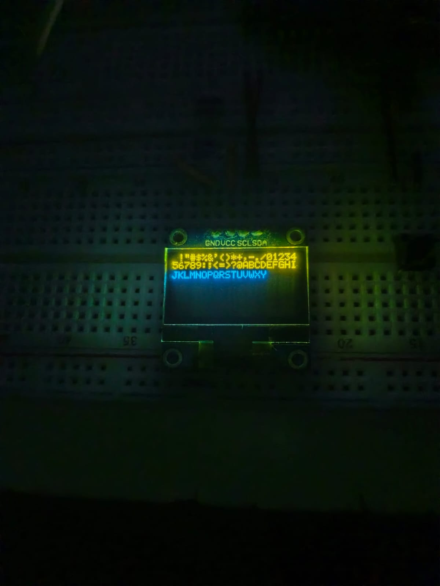
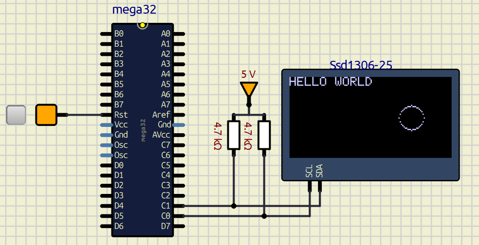

# ATMega32 OLED Driver (SSD1306, I<sup>2</sup>C)

A hand-rolled, RAM-focused C driver for SSD1306-based I<sup>2</sup>C OLEDs, bult for the ATMega32. **No frame buffer, no heap, no floating point.** The font lives in flash, scratch buffers live in `.bss`, and every pixel is computed on the fly and streamed straight into the displays GDDRAM on top of my custom TWI/I<sup>2</sup>C driver. The result: the driver's entire static RAM footprint is a few hunder bytes, leaving the ATMega32's precious 2 KB of SRAM for your actual application.



I swear to god this image is not AI generated, my phone's camera just does that in low lighting 🥲.

## Content
- [ATMega32 OLED Driver (SSD1306, I2C)](#atmega32-oled-driver-ssd1306-i2c)
  - [Content](#content)
  - [What is this?](#what-is-this)
  - [The Challenge](#the-challenge)
  - [Design Philosophy: the SSD1306's GDDRAM *is* the framebuffer](#design-philosophy-the-ssd1306s-gddram-is-the-framebuffer)
  - [RAM Saving Techniques](#ram-saving-techniques)
    - [RAM Budget](#ram-budget)
  - [Features](#features)
    - [Planned Features](#planned-features)
  - [Requirements](#requirements)
    - [Hardware](#hardware)
    - [Software \& Toolchain](#software--toolchain)
  - [Wiring / Pinout](#wiring--pinout)
  - [Quick Start](#quick-start)
  - [API Overview](#api-overview)
  - [AI Usage Declaration](#ai-usage-declaration)

## What is this?
This project is a lightweight C driver for I<sup>2</sup>C OLEDs, designed for the ATMega32 AVR microcontroller. It abstracts the low-level communication protocol, and provides a clean API to send commands and data. This allows developers to interact with the display smoothly without needing to memorize or constantly reference the controller's native hex command codes. Raw command/data escape hatches are still exposed for when you want to talk to the controller directly.

## The Challenge
Recently, I challenged myself to build a [TWI/I²C driver for the ATMega32](https://github.com/yousseftechdev/ATMega32-TWI-driver) using *only* the official datasheet. It was a highly educational experience that pushed my problem solving skills to the limit.

This OLED driver is the next layer up. While the TWI driver handles communication, this module handles display initialization, rendering logic and graphics operations, developed by relying exclusively on the [SSD1306 datasheet](https://cdn-shop.adafruit.com/datasheets/SSD1306.pdf).

## Design Philosophy: the SSD1306's GDDRAM *is* the framebuffer
The SSD1306 already contains 1 KB of GDDRAM. Most libraries mirror that entire screen into a RAM buffer on the MCU, do their drawing there, and flush it over I<sup>2</sup>C. On an ATMega32, that mirror alone eats **1024 bytes (half of SRAM)**, before you application has allocated even a single variable.

This driver refuses that trade. The display's own GDDRAM is treated as the single source of truth. Every primitive (lines, rectangles, circles, text) computes its pixels on the fly, opens a memory window on the controller (`0x21`/`0x22`) and streams only the bytes that actually change. Nothing is ever mirrored, cached or
read back into the AVR.

## RAM Saving Techniques
1. **Zero frame buffer (−1024 B).** All drawing is write-only, streamed directly
   into GDDRAM. The biggest win: 50% of the SRAM simply never gets touched.
2. **Font stored in flash via `PROGMEM` (−295 B RAM).** The 5×7 font (59 glyphs ×
   5 bytes) is compiled into program memory and read one column at a time with
   `pgm_read_byte()`. It costs zero bytes of RAM.
3. **Static `.bss` scratch buffers.** The chunk buffers used by the fill/clear/
   rectangle routines are declared `static`, so the linker places them in `.bss`
   exactly once, at compile time. They are shared across every call, never pushed
   onto the stack, never allocated from a heap, and make the driver's worst-case
   RAM usage knowable *before* you ever flash the chip.
4. **Chunked, page-wise streaming.** The screen is never assembled in one buffer.
   Full-screen fills/clears are sent as eight 129-byte bursts (1 control byte +
   128 column bytes per page), the buffer never needs to be bigger than one row.
5. **Windowed partial updates.** `OLED_vSetWindow()` uses the column/page address
   commands so only the dirty rectangle travels over the wire. Less I²C traffic,
   less rendering time, and no read-modify-write buffer needed on the MCU side.
6. **Integer-only graphics.** Circles use the midpoint algorithm with pure integer
   math, no lookup tables, no `float`, and therefore no hidden `libm` stack/bss
   costs dragged into your build.
7. **Hardware offload for animation.** Marquee/scroll effects use the SSD1306's
   built-in scroll engine (`0x26`/`0x27` + `0x2F`). The controller does all the
   work: 0 bytes of RAM and 0% CPU on the AVR while text glides across the screen.
8. **Zero-copy hand-off to the TWI driver.** Buffers are passed by pointer and
   streamed byte-by-byte from the caller's own array by the TWI ISR, no
   intermediate FIFOs, no `memcpy` chains.

### RAM Budget
| Consumer | Typical framebuffer library | This driver |
| :--- | :--- | :--- |
| Screen mirror (GDDRAM copy) | 1024 B | **0 B** |
| Font table | ~300 B (RAM) | **0 B** (295 B in flash) |
| Scratch / TX buffers | stack/heap, varies | **387 B** fixed in `.bss` |
| Heap allocations | possible | **none** (`malloc` is never used) |
| **Worst-case total** | **≥ ~1.3 KB (≥ 65% of SRAM)** | **< 400 B (~19% of SRAM)** |

## Features
- Graphics primitives: pixel, horizontal/vertical lines, filled rectangle, hollow
  rectangle, hollow circle (midpoint algorithm)
- 5×7 text rendering with automatic page-splitting (ASCII 32–90)
- Hardware horizontal scrolling with selectable page band and speed
- Full-screen fill and clear
- Memory windowing API for custom rendering
- Low-level escape hatches: send raw command/data bytes, single-shot or streamed
- Interrupt-driven, 400 kHz I<sup>2</sup>C via the companion TWI driver

### Planned Features
- 128x32 display mode
- Filled circle (`OLED_vFillCircle` — in progress, see `TODO` in source)
- Lowercase / extended ASCII font (currently a `TODO` in the font table)
- GDDRAM read-back helpers that don't cost half the RAM
- Merging the three scratch buffers into one shared buffer (−258 B)

## Requirements

### Hardware
To run and test this driver, you will need the following hardware:
* **Microcontroller:** ATMega32 or ATMega32A (DIP or TQFP package).
* **OLED Display:** SSD1306-based I<sup>2</sup>C OLED Display (128x64 resolution).
* **Programmer:** An ISP programmer such as USBasp, AVRISP mkII, or Atmel-ICE.
* **Basic Electronics:** Breadboard, jumper wires, and a stable power supply (5V or 3.3V).
* **Pull-up Resistors:** Two 4.7kΩ resistors for the SDA and SCL lines *(Note: Many OLED breakout boards already have these built-in, check your module's schematic)*.

### Software & Toolchain
You will need a standard AVR development environment to compile and flash the code:
* **Compiler:** `avr-gcc` (AVR 8-bit Toolchain).
* **Build System:** `make` (GNU Make) to build the project via the provided Makefile.
* **Flashing Utility:** `avrdude` (to upload the compiled `.hex` file to the microcontroller).
* **Dependencies:** This library relies on my custom [ATMega32 TWI/I<sup>2</sup>C driver](https://github.com/yousseftechdev/ATMega32-TWI-driver). Ensure its source files are included and properly linked in your build environment.

## Wiring / Pinout
The ATMega32 uses its hardware TWI (Two-Wire Interface) pins for I<sup>2</sup>C communication. Connect your OLED display as follows:

| OLED Pin | ATMega32 Pin     | Description                                      |
| :------- | :--------------- | :----------------------------------------------- |
| **GND**  | GND              | Common Ground                                    |
| **VCC**  | 5V or 3.3V       | Power Supply (Check your OLED's voltage rating!) |
| **SCL**  | **PC0** (Pin 22) | I<sup>2</sup>C Clock                             |
| **SDA**  | **PC1** (Pin 23) | I<sup>2</sup>C Data                              |

## Quick Start
```c
#include "OLED_interface.h"
#include <avr/interrupt.h>

int main(void)
{
    sei();                 /* TWI layer is interrupt-driven */
    OLED_vInit();          /* 400 kHz I²C + SSD1306 init sequence */
    OLED_vClear();

    OLED_vText(0, 0, "HELLO WORLD");
    OLED_vCircle(96, 32, 10);
    _delay_ms(50);

    /* Marquee: scroll the whole screen left, 4-frame interval */
    OLED_vScrollH(OLED_SCROLL_LEFT, 0, 7, OLED_SCROLL_4FR);

    while (1);             /* The SSD1306 now scrolls with 0% CPU usage */
}
```




## API Overview
| Function | Purpose |
| :--- | :--- |
| `OLED_vInit()` | TWI setup + full SSD1306 initialization sequence |
| `OLED_vClear()` / `OLED_vFill(byte)` | Wipe or fill the entire GDDRAM |
| `OLED_vSetWindow(c0, c1, p0, p1)` | Restrict writes to a column/page rectangle |
| `OLED_vPixel(x, y)` | Single pixel |
| `OLED_vLineH / OLED_vLineV` | Horizontal / vertical lines |
| `OLED_vFillRectangle` / `OLED_vRectangle` | Filled / outlined rectangle |
| `OLED_vCircle(x0, y0, r)` | Hollow circle (midpoint algorithm) |
| `OLED_vChar(x, y, c)` / `OLED_vText(x, y, s)` | 5×7 character / string, page-split aware |
| `OLED_vFontShowcase()` | Prints the whole font table (debug/demo) |
| `OLED_vScrollH(dir, p0, p1, speed)` / `OLED_vScrollStop()` | Hardware horizontal scrolling |
| `OLED_vSendCmd / vSendData` | Raw single command/data byte |
| `OLED_vStreamCmds / vStreamData` | Raw command/data bursts (index 0 of your array is overwritten with the control byte!) |

## AI Usage Declaration
- Gemini AI was used for debugging purposes; usage can be verified in Lapse (https://lapse.hackclub.com/timelapse/n_QSRWfL-Uo1)
- GitHub Copilot was used to help write working example code for showcasing
- Qwen AI helped with designing the font in hex format