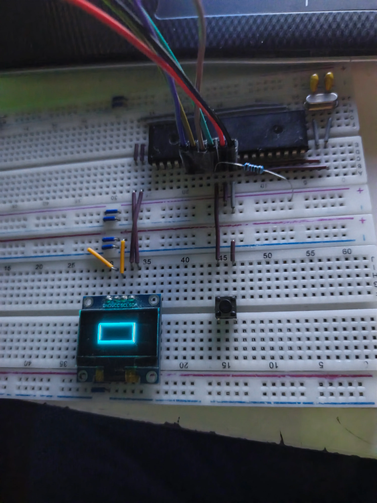

# ATMega32 OLED Driver
This is a custom OLED driver written in C for the ATMega32 AVR microcontroller from Atmel/Microchip, designed to be ultra RAM saving, as it doesn't use a frame buffer, stores the font in flash instead of in RAM, and stores temporary buffers in BSS memory during operation only, leaving room for the rest of the code running on the ATMega from the main application. It requires my custom I2C driver as a base dependency.

I swear to god this image is not AI generated, my phone's camera just does that in low lighting 🥲.

## Content
- [What is this?](#what-is-this)
- [The Challenge](#the-challenge)
- [Features](#features)
    - [Planned features](#planned-features)
- [Requirements](#requirements)
    - [Hardware](#hardware)
    - [Software](#software)
- [Wiring / Pinout](#wiring--pinout)

## What is this?
This project is a lightweight C driver for I2C OLEDs, designed for the ATMega32 AVR microcontroller. It abstracts the low-level communication protocol, and provides a clean API to send commands and data. This allows developers to interact with the display smoothly without needing to memorize or constantly reference the controller's native hex command codes.

## The Challenge
Recently, I challenged myself to build a [TWI/I2C driver for the ATMega32](https://github.com/yousseftechdev/ATMega32-TWI-driver) using *only* the official datasheet. It was a highly educational experience that pushed my problem solving skills to the limit.

Building further on that, I created this OLED driver as the next layer. While the TWI driver handles the communication, this driver manages display initialization, rendering logic, and graphics operations. To keep the challenge going, I developed this module by relying exclusively on the [SSD1306 OLED display datasheet](https://cdn-shop.adafruit.com/datasheets/SSD1306.pdf).

## Features
- Fast
- Low RAM usage
- Shapes + Text
- Low-level helper functions to send data and command bytes yourself

### Planned Features
- 128x32 mode
- Functions to help read the buffer without using up half the RAM

## Requirements

### Hardware
To run and test this driver, you will need the following hardware:
* **Microcontroller:** ATMega32 or ATMega32A (DIP or TQFP package).
* **OLED Display:** SSD1306-based I2C OLED Display (128x64 resolution).
* **Programmer:** An ISP programmer such as USBasp, AVRISP mkII, or Atmel-ICE.
* **Basic Electronics:** Breadboard, jumper wires, and a stable power supply (5V or 3.3V).
* **Pull-up Resistors:** Two 4.7kΩ resistors for the SDA and SCL lines *(Note: Many OLED breakout boards already have these built-in, check your module's schematic)*.

### Software & Toolchain
You will need a standard AVR development environment to compile and flash the code:
* **Compiler:** `avr-gcc` (AVR 8-bit Toolchain).
* **Build System:** `make` (GNU Make) to build the project via the provided Makefile.
* **Flashing Utility:** `avrdude` (to upload the compiled `.hex` file to the microcontroller).
* **Dependencies:** This library relies on my custom [ATMega32 TWI/I2C driver](https://github.com/yousseftechdev/ATMega32-TWI-driver). Ensure its source files are included and properly linked in your build environment.

## Wiring / Pinout
The ATMega32 uses its hardware TWI (Two-Wire Interface) pins for I2C communication. Connect your OLED display as follows:

| OLED Pin | ATMega32 Pin | Description |
| :--- | :--- | :--- |
| **GND** | GND | Common Ground |
| **VCC** | 5V or 3.3V | Power Supply (Check your OLED's voltage rating!) |
| **SCL** | **PC0** (Pin 22) | I2C Clock |
| **SDA** | **PC1** (Pin 23) | I2C Data |

## AI Usage Declaration
Gemini AI was used for debugging purposes, usage can be verified in Lapse (https://lapse.hackclub.com/timelapse/n_QSRWfL-Uo1)
Github Copilot was used to help write working example code for showcasing